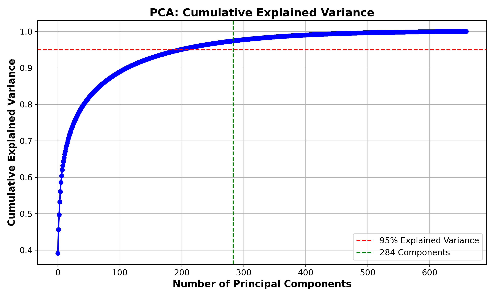

# Building Protein Solubility Prediction Models with Natural Language Processing
Nathan Lanclos and Jonah Weigand-Whittier
Public Health 245 - Final Project Proposal - November 13, 2024

## Background
Protein solubility depends on numerous biophysical parameters, including surface charge2, amino acid composition, solvent accessibility, and secondary structures. Prediction of protein solubility is of critical importance for biophysical research, protein chemistry, and drug design1. The ability to predict protein solubility in silico enables researchers to inform protein engineering decisions and save experimental time, but currently available methods have numerous limitations for broad use. Most modern tools are difficult to implement and use, cannot run on all proteins, and do not use state-of-the-art tools for protein structure prediction and feature extraction.

## Objectives
With recent machine learning advances, specifically natural language processing and structure prediction, we intend to produce a model that can predict solubility more accurately than existing models and implement easy-to-use interfaces for broad adoption. Our goal is to generate a continuous solubility coefficient for each prediction. We aim to build numerous models of increasing complexity based on feature sets as we progress, starting with simple regression tasks and ending with gradient boosting or graph neural networks. 

## Project Summary
Data: Data for building the model will be sourced from the GATSol3 github repository to facilitate benchmarking against leading models. The dataset before feature engineering and a test/train split has a shape of 2679x3 with columns [‘gene’,’solubility’,’sequence’]. 

Feature Engineering (Figure 1): Summary statistic sequence and structural coefficients (length, complexity, # secondary structures, etc) will be engineered following EDA with one hot encoding if necessary. 1280 dimensional embeddings will be produced with ESM2, 20 dimensional embeddings will be produced with Blosum, and these two vectors will be concatenated. We will produce embedding-based features with dimension reduction via PCA and experiment with the number of principal components utilized, and critically analyze our PCA to assess the optimal number of principal components (95% cumulative explained variance). Graph networks will be built for proteins by initializing alpha carbons as nodes and interatomic distances between them as edges based on integrated ESMFold v1 predicted structures. 

Modeling: Our goal is to increase model accuracy as much as we can leading up to the project deadline by mastering simple models and increasing complexity as we generate features. We will build linear and logistic regression models using simple features as a baseline, followed by XGBoost models incorporating high dimensional embeddings, and then graph neural networks for protein graph representation-based predictions. For each model, appropriate loss functions and evaluation metrics will be employed. We realize scope may be relatively extensive, and as this project will push our group to the edge of our abilities, we hope to see how far we can get. 

## References 
1.	Qing R, Hao S, Smorodina E, Jin D, Zalevsky A, Zhang S. Protein Design: From the Aspect of Water Solubility and Stability. Chem Rev. 2022;122(18):14085-14179. doi:10.1021/acs.chemrev.1c00757
2.	Kramer RM, Shende VR, Motl N, Pace CN, Scholtz JM. Toward a Molecular Understanding of Protein Solubility: Increased Negative Surface Charge Correlates with Increased Solubility. Biophys J. 2012;102(8):1907-1915. doi:10.1016/j.bpj.2012.01.060
3.	Li B, Ming D. GATSol, an enhanced predictor of protein solubility through the synergy of 3D structure graph and large language modeling. BMC Bioinformatics. 2024;25(1):204. doi:10.1186/s12859-024-05820-8
